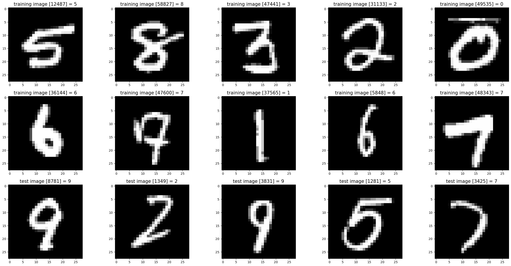
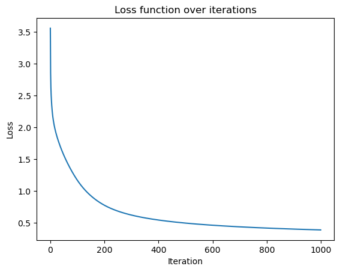
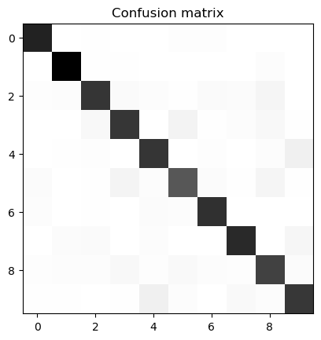

# Neural Network from Scratch

This project demonstrates how to build a neural network from scratch using only NumPy and basic linear algebra. The goal is to classify handwritten digits from the well-known MNIST dataset, replicating a neural network's functionality without relying on deep learning libraries like TensorFlow or PyTorch.

## Inspiration

This implementation is inspired by [Samson Zhang's YouTube video](https://youtu.be/w8yWXqWQYmU?si=84GMJdX_9kyv3SuW), where he explores the principles of constructing a neural network from the ground up.

    
     
    <em>Example images from the MNIST dataset</em>

## Features

- **Custom Neural Network Implementation:** 
  - Two-layer fully connected network.
  - ReLU activation function for hidden layers.
  - Softmax function for multi-class classification.
  - Categorical cross-entropy for loss calculation.
  
- **Data Handling:**
  - Custom MNIST dataset loader implemented using Python's `struct` and `numpy`.
  - Normalization and reshaping of input images to be compatible with the neural network.

- **Learning from Scratch:**
  - Manual implementation of forward propagation, backward propagation, and gradient descent.
  - Parameter initialization, activation functions, and derivatives implemented from first principles.

## How It Works

### Data Loading
The MNIST dataset is loaded using a custom data loader (`MnistDataloader`), which parses the raw `.idx` files into NumPy arrays. The training and test datasets are normalized to a range of [0, 1] for effective learning.

### Neural Network Architecture
- **Layer 1:** 784 input features → 10 neurons.
- **Layer 2:** 10 neurons → 10 neurons (one for each class).
- **Activation Functions:**
  - Hidden Layer: ReLU
  - Output Layer: Softmax
- **Loss Function:** Categorical cross-entropy.

### Training
- **Forward Propagation:** Computes activations and predictions.
- **Backward Propagation:** Calculates gradients using the chain rule.
- **Gradient Descent:** Updates weights and biases based on gradients with a learning rate.

### Key Functions
- `forward_propagation`: Computes activations for each layer.
- `backward_propagation`: Computes gradients for all weights and biases.
- `update_parameters`: Updates model parameters based on gradients.
- `gradient_descent`: Iteratively optimizes the model using the above functions.

## How to Use

### Dependencies
- `numpy`
- `matplotlib`
- `pandas`

### Instructions
1. Ensure you have the required dependencies installed.
2. Navigate to the `src` folder.
3. Open and run the `neural_network.ipynb` notebook.

### Customization
You can adjust parameters such as the number of iterations and other hyperparameters within the notebook to suit your needs.

## Results
The network is able to achieve an accuracy of around 90% on the MNIST dataset after training for 1000 iterations. The accuracy can be further improved by training for more iterations or adjusting the hyperparameters. To achieve better results, you might need to adjust the structure of the neural network, such as adding more hidden layers or increasing the number of neurons. However, the simplicity of the current network architecture, with only one hidden layer and a limited number of neurons, might restrict its ability to capture more complex patterns in the data.

For state-of-the-art performance on image classification tasks like MNIST, more advanced techniques and architectures, such as convolutional neural networks (CNNs), are typically required. These architectures are specifically designed to handle the complexities of image data and can significantly improve classification accuracy.

### Visualizations

    
     
    <em>Evolution of the loss on the training set over the iterations</em>

The loss is smooth on the training set, indicating that the network is learning effectively. This suggests that the network is able to minimize the error during training and is on the right path to achieving good performance.

    
     
    <em>Confusion Matrix of the Neural Network's Predictions</em>

The confusion matrix provides a detailed breakdown of the network's performance by showing the number of correct and incorrect predictions for each class. Each row of the matrix represents the true labels, while each column represents the predicted labels. The diagonal elements indicate the number of correct predictions, while the off-diagonal elements show the misclassifications. This visualization helps in identifying specific classes where the network performs well and classes where it struggles, providing insights for further improvements. Overall, the network's performance seems very good, but we can see that it struggles the most (although the results are still very good) with distinguishing between the digits 3 and 5, and 4 and 9.

## Conclusion
Building a neural network from scratch is a great way to understand the underlying principles and mechanisms of deep learning. By implementing the network using basic algebra and numpy, we gain a deeper insight into how neural networks work and how they can be trained to perform complex tasks like image classification. The MNIST dataset is a great starting point for experimenting with neural networks, as it provides a simple yet challenging task that can be used to test and validate our implementation.

While the network we built is relatively simple and has limitations in terms of performance, it serves as a solid foundation for further exploration and experimentation. By adjusting the network architecture, hyperparameters, and training process, we can improve its performance and potentially achieve state-of-the-art results on the MNIST dataset. Additionally, we can apply the knowledge gained from this project to more advanced neural network architectures and tasks, such as object detection, natural language processing, and reinforcement learning.

### Ideas for improvement
- Experiment with different network architectures, such as adding more hidden layers, increasing the number of neurons, or using different activation functions.
- Experiment with different initialization methods for the network weights, such as Xavier or He initialization, to potentially improve the training process and convergence speed.
- Implement more advanced optimization algorithms, such as Adam or RMSprop, to improve the training process and convergence speed.
- Experiment with different loss functions, such as mean squared error or softmax cross-entropy, to potentially improve the network's performance.
- Implement regularization techniques, such as L1 or L2 regularization, to prevent overfitting and improve the generalization of the network.
- Experiment with different hyperparameters, such as learning rate, batch size, and number of iterations, to optimize the training process and achieve better results.

## Acknowledgements

Special thanks to Samson Zhang for the inspiration and guidance provided through his YouTube video. Feel free to check out his channel for more interesting content on deep learning and machine learning.